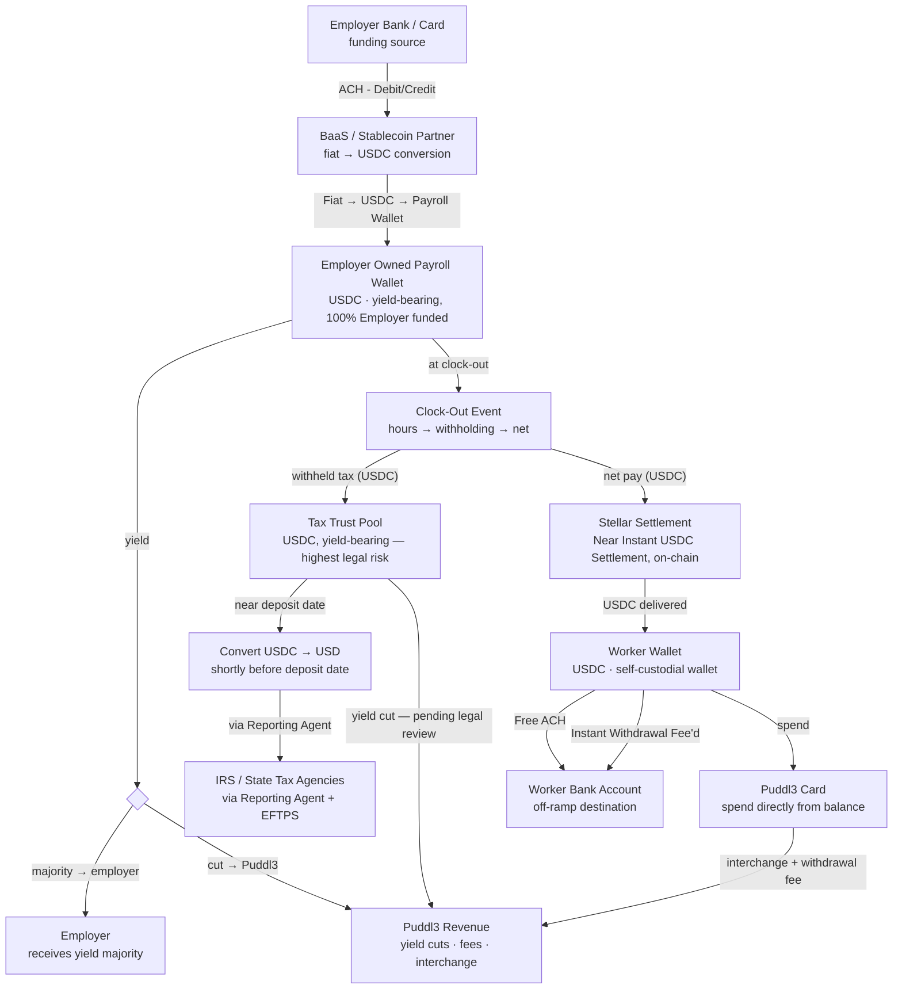

# Money Flow Operations

Traces the actual movement of money end-to-end — from employer funding through to worker spend and tax remittance — tying together mechanics already defined in [[Revenue Models]], [[Frontend-Backend]], [[Tax Withholdings]], and [[Legal]].

## 1. Employer funding
Employer opens the Puddl3 dashboard, clicks "Add Funds," connects a bank account or debit card, and enters an amount. Fiat is pulled via ACH/debit and routed through the BaaS/stablecoin infra partner (see [[Tech Stack]]), which converts **100% of the deposited amount to USDC immediately** — not just the portion that will eventually become net pay. This lands as the employer's Payroll Wallet balance.

## 2. Payroll wallet float — yield generation begins
The Payroll Wallet balance sits as USDC (or an underlying yield-bearing/tokenized-treasury instrument) for as long as it's undisbursed, continuously generating yield. This is Revenue Stream 1 in [[Revenue Models]]: Puddl3 takes a flat % cut, the remainder is passed back to the employer periodically. This yield-share is also marketed as an employer benefit, not just a cost offset (see [[Marketing]]).

## 3. Clock-out event — the split
Each clock-out (max 2/day — lunch + end-of-shift, each an independently final mini pay-period per [[Tax Withholdings]]) triggers:
1. Hours since the last payout → gross pay for that mini pay-period.
2. Live tax/withholding calculation via the embedded payroll API — employee-side withholding (federal/state/local) and employer-side liabilities (FICA match, FUTA/SUTA).
3. Net pay = gross minus employee withholding.
4. Funding check against the Payroll Wallet balance.
5. **The split**: the Payroll Wallet's USDC divides into two flows that never recombine:
   - **Net pay (USDC)** → sent instantly over Stellar to the worker's wallet.
   - **Withheld tax (USDC)** — both employee withholding and the employer-side tax liability — moves out of the Payroll Wallet into a separate **Tax Trust pool**. It does not touch the worker at any point.

## 4. Tax trust pool — second yield stream, then remittance
The Tax Trust pool holds withheld amounts **as USDC/yield-bearing instrument**, continuing to generate yield (Revenue Stream 2 in [[Revenue Models]]) right up until shortly before the statutory federal/state deposit date (semiweekly or monthly depending on employer size — see [[Tax Withholdings]]). Unlike the Payroll Wallet yield, this yield is not necessarily shareable with the employer — it's trust fund money (IRC §7501), and whether/how it can generate yield at all is the single highest-priority open legal question (see [[Legal]]). Shortly before the deposit date, the trust balance due is **converted back to USD** and remitted by the embedded payroll partner, acting as IRS Reporting Agent, to the IRS (via EFTPS) and state tax agencies.

## 5. Worker side — spend, hold, or cash out
Once USDC lands in the worker's wallet, three paths:
- **Spend** directly via the Puddl3-issued card — generates interchange revenue (Stream 4).
- **Free standard ACH** withdrawal to their bank account (slower, no fee).
- **Instant withdrawal** to their bank account for a flat 2–3% fee — Puddl3 revenue (Stream 3).

## 6. Puddl3's own revenue collection
Puddl3's operating account periodically sweeps in: its cut of Payroll Wallet yield, its cut of Tax Trust yield (pending legal confirmation this is permissible at all), instant-withdrawal fees, and card interchange.

## Diagram

The clock-out event sits **inline** in the spine: money flows from the Payroll Wallet *through* it, and that is where each payment splits in two — net pay continues down to the worker, withheld tax branches into the trust pool. Both halves originate from the thing that actually causes the split.

**Note on the revenue lines:** in the visual chart, card interchange and the instant-withdrawal fee are drawn as a single merged line from the Puddl3 Card to Puddl3 Revenue, purely to avoid two near-identical parallel lines. Mechanically they remain two distinct revenue streams (Streams 3 and 4 in [[Revenue Models]]), and the withdrawal fee is charged on the withdrawal itself, not on card spend.

## Source files
- **Interactive/designed version:** published as a Claude Artifact — https://claude.ai/code/artifact/17c6b4c9-34f0-4aea-bbec-be6fcceb3098
- **Editable source:** `Money Flow Diagram.html` in this directory — self-contained (fonts embedded), opens directly in a browser, and is the file to edit if the chart needs changes.

